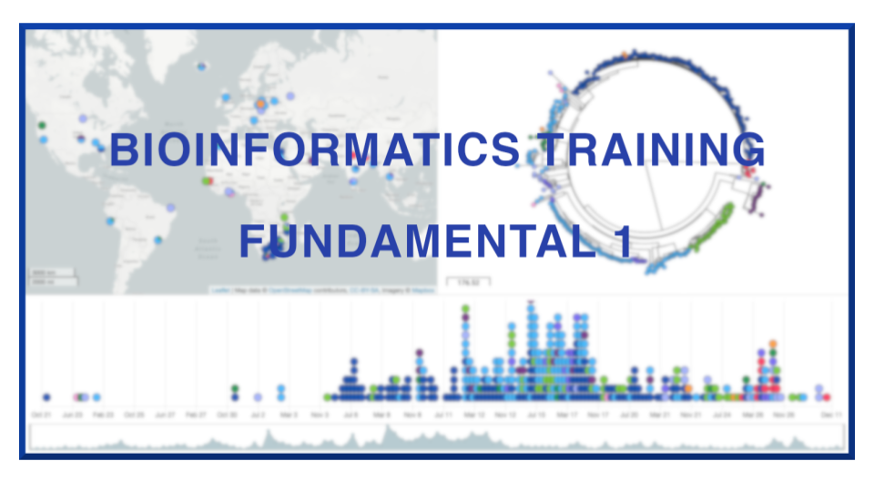

   </img>

<h1 style="text-align:center">Welcome to Fundamental 1</h1>

In this training module, we will use three different web-based tools, [Microreact](https://microreact.org/showcase) and [Phandango](https://github.com/jameshadfield/phandango/wiki) to visualise phylogenetic trees and metadata. We will explore [Pathogenwatch](https://pathogen.watch/) as a method of browsing publically available genomes and associated metadata. We will cover the different file types used by the web-based tools, how to customise your data and how to save the figures you generate which can be used in publications.

>**Educators**
 Christine Boinett (Lead educator), Stephanie W. Lo, Dorota Jamrozy and Stephen Bentley.

>**Contributors** 
 Christine Boinett, Gareth Peat, Stephanie W. Lo, Dorota Jamrozy, Neil MacAlasdair, Kate Baker and Stephen Bentley. 

 &copy; [Wellcome Sanger Institute](https://www.sanger.ac.uk/)
