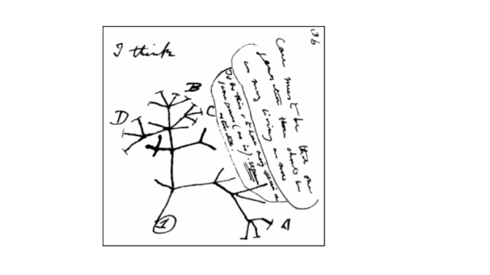
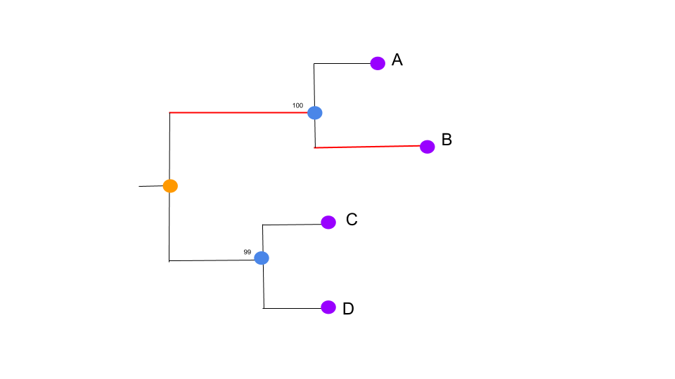
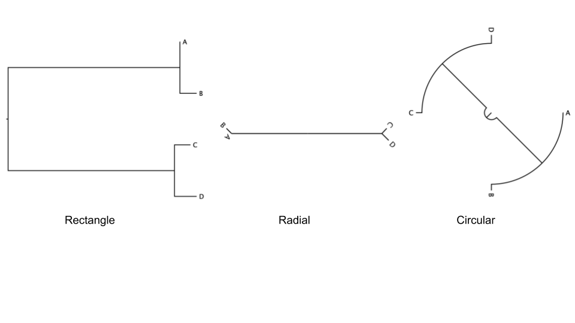

<h1 style="text-align:center">Introduction to phylogenetics</h1>

## Introduction
Phylogenetic trees based on whole genome data tell us about the relationships of bacterial isolates to each other on a very fine scale. When we combine that high-resolution information about the evolutionary relationships of isolates with geographical data it can inform our understanding of the current distribution of the pathogen and allow us to infer the epidemiological processes that have acted on the bacteria over time. The simplest example of this would be if a phylogeny showed that a pathogen was geographically constrained (e.g. isolates from the same region always cluster together). This might indicate that the pathogen is not rapidly spread. Whereas a pathogen with a phylogeny that shows isolates from distant regions are likely to be related to isolates from nearby, the interpretation is that the pathogen is likely to be spread across regional borders. Geographical referencing of genomic data can also be combined with temporal information to study the movement of pathogens in space and time. This is most useful when done in real time and thus can be useful for outbreak detection and monitoring.

**Data files**
 We have provided data files required for this module, available for download [here](ftp://ftp.sanger.ac.uk/pub/pathogens/bactGen_training/f1/).

**Slack channel**
 Throughout the module, there will be questions referring you to answer or comment on the slack channel. Please note that this is a private slack channel and access is only for Juno and GPS2 project partners. If you are not part of these projects, you are more than welcome to undertake the modules, however there will be no support.

!>**DISCALIMER**
 The F1 example denoting sample locations across the UK are fictitious and solely used for educational purposes. These data were never collected from the GPS coordinates quoted.

---

   </img>

Sketch by Charles Darwin circa 1837. Image source: wikimedia commons

## Phylogenetic trees
Phylogeny is the study of genetic relationships between different taxa, or in our case, bacterial samples. Because we can infer relationships between samples collected at different times, sources and places, we can use this tool to trace the evolution and spread of a bacterial pathogen and has been a very useful tool to identify disease outbreaks. 
Phylogenetic trees are referred to as trees because of their likeness to trees in nature, with a root, branches and leaves. The root denotes the common ancestral lineage or strain, the branches is the relationship between the strains and the leaves are the different samples or taxa.

Phylogenetic trees are constructed based on mathematical models that apply the nucleotide (or amino acid) substitution rate and the time in which it has taken to achieve these changes to describe the evolution and estimate the genetic change. The genetic change is the nucleotide substitutions per site, also known as the genetic distance. We use this measurement to construct the branches of the trees. Subsequently a statistical method is used to measure the tree quality known as the ‘likelihood’.

Tree interpretation requires us to first know the elements that make up the tree. There are four main characteristics, _**a)**_ the **topology**, describes the shape of the tree, _**b)**_ the **branches**, describe the genetic change between samples and lastly _**c)**_ the **nodes**, the points at the end of branches (red) which can be at the root (orange), internal (blue) or the tip or leaf (purple). You may sometimes see numbers on the nodes of trees, these are the bootstrap values that denote the confidence or accuracy of  the tree.

   </img>

The root of the tree represents the ancestral strain and the tips or leaves are the descendants. The same topology tree can be drawn in different ways with the most popular formats being rectangular, radial and circular. Choosing the format is down to you and how the type of tree you choose best represents your data. For example when you have few samples it may suit to draw a rectangular tree, but when you have hundreds or even thousands, maybe a radial tree would be a better choice.

   </img>

When reading the tree, the vertical distance in a rectangular tree doesn't mean anything and the nodes can be freely rotated. It is the branch length (horizontal distance) that will link the rectangular tree to the other type of tree hence the type of tree can be altered without altering the information describing the evolutionary relationship between the different taxa or samples.

### Further resources
 [EMBL-EBI](https://www.ebi.ac.uk/training/online/course/introduction-phylogenetics/what-phylogenetics)
 [Nature education](https://www.nature.com/scitable/topicpage/reading-a-phylogenetic-tree-the-meaning-of-41956/)
 [Evolution](https://evolution.berkeley.edu/evolibrary/article/evo_05) 
 [FutureLearn course](https://www.futurelearn.com/courses/introduction-to-bacterial-genomics/0/steps/45314)

 &copy; [Wellcome Sanger Institute](https://www.sanger.ac.uk/)