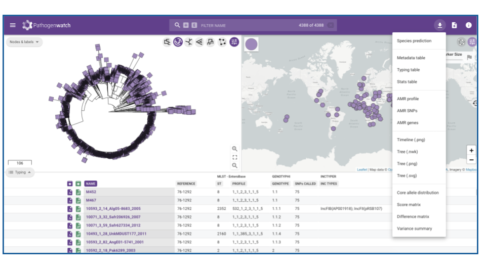

<h1 style="text-align:center">Pathogenwatch</h1>

[Pathogenwatch](https://pathogen.watch/) watch is an interactive online tool that analyses your whole genome (WGS) data and provides a visual output. However, in this module, we will only focus on using existing genomes on the platform to explore and download publicly available genomes.

### Browsing genomes
To beggin, watch the video below. The time stamp you need is till 0:00 to 0:54 where you will learn to select sequences of interest. We will cover the latter half of the video in F2.

   <iframe width="560" height="315" src="https://www.youtube.com/embed/Q8bDuZZ3hXg" frameborder="0" allow="accelerometer; autoplay; encrypted-media; gyroscope; picture-in-picture" allowfullscreen></iframe>

### Exercise
With your new found knowledge on how to browse genomes in pathogen watch. Navigate to the ‘genomes’ tab. Filter for _Streptococcus pneumoniae_. 

>**Question 3**
 How many genomes are from South Africa?

>**Question 4**
 How many of these belong to serotype 1 (ser.01)?

>**Question 5**
 What years did these samples range?

In the slack channel, share your answers with other participants.

### Browsing collections
You can also explore genome collections of several species in the _'collections'_ tab. Although only a limited number are supported, there is a wealth of information contained here. Navigate to the _Salmonella_ Typhi public genome collection. Click _'view collection'_ (you may need to hover over the area to see the link to _'view collection'_). Here you can view the phylogenetic structure of nearly 5000 strains in the collection. You can choose to browse the data and filter it by a particular characteristic in the data. The most powerful use of the collection data, is the ability to download the metadata and other genotypic information as shown in the image below. Give it a try!

   </img>

 &copy; [Wellcome Sanger Institute](https://www.sanger.ac.uk/)