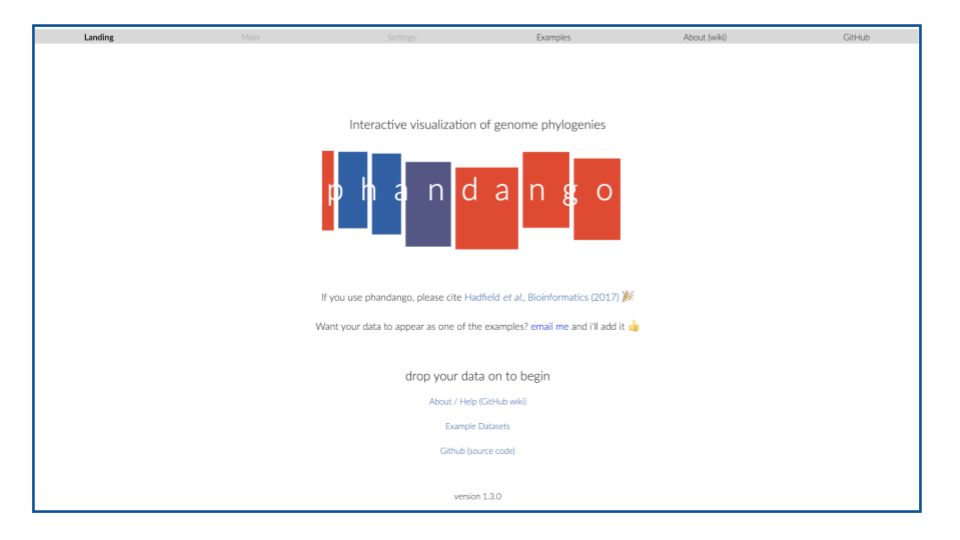
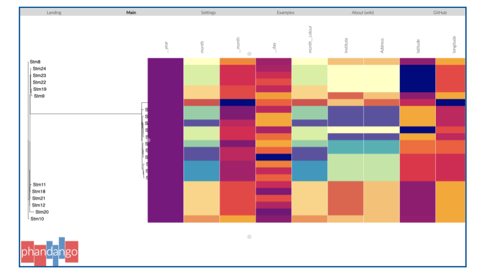
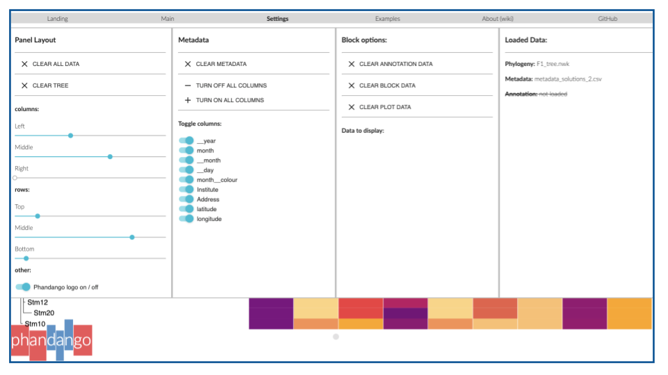
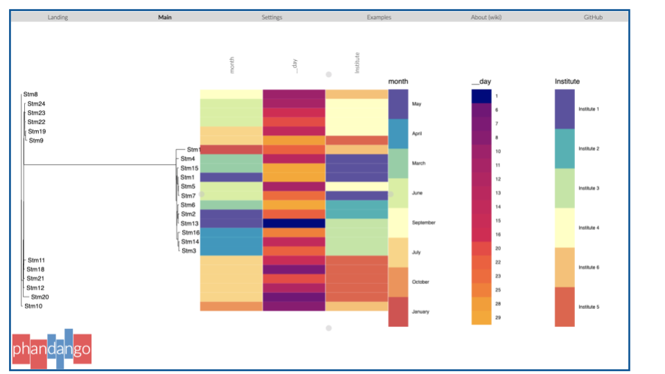
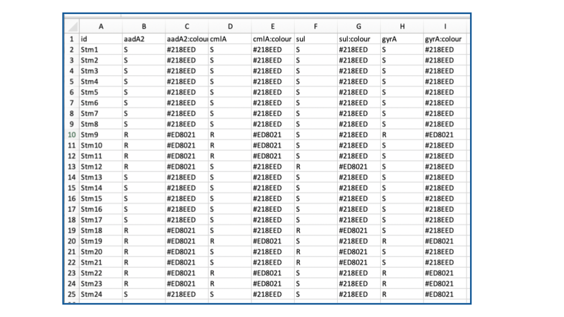
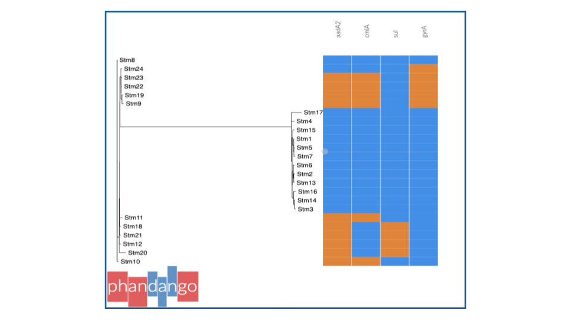
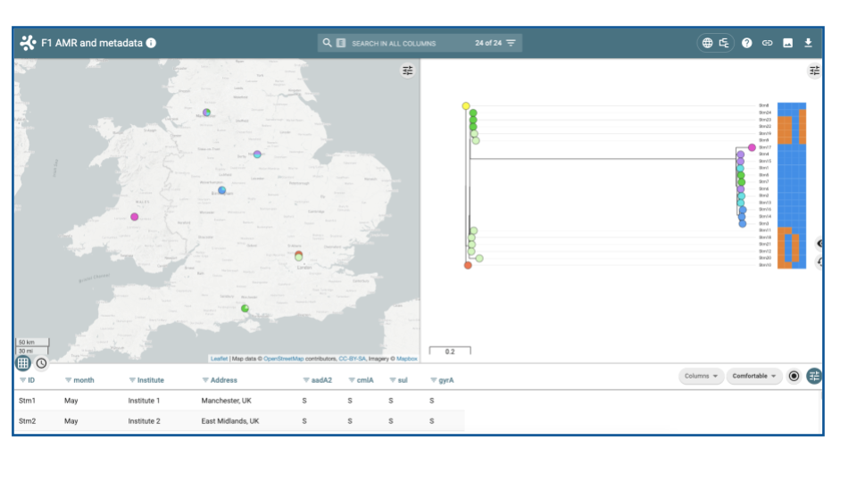

<h1 style="text-align:center">Phandango</h1>

[Phandango](https://jameshadfield.github.io/phandango/#/) is an interactive visualisation tool for phylogenetics trees and can be viewed with other information that would benefit from a visual output such as metadata (e.g. resistance, virulence, serotyping and multi locus sequence typing or MLST data) and genomic structure information (e.g pangenome, recombination blocks, genome wide association studies or GWAS). More information on the examples of data that can be displayed can be found [here](https://jameshadfield.github.io/phandango/#/examples).

Citation: [Hadfield et al., Bioinformatics (2017)](https://doi.org/10.1093/bioinformatics/btx610).

### Loading your data
Phandango, like microreact requires the user to provide a phylogenetic tree file in NEWICK format as before and the accompanying data in specific formats. For the first exercise we will first practise using the data we have from the previous section. Navigate to the [phandango](https://jameshadfield.github.io/phandango/#/) homepage and select **both** the tree file (F1_tree.nwk) and the metadata.csv file that you formatted and saved for microreact and ‘drop’ them onto the page.

   </img>

The results should load like in the image below.

   </img>

You will notice the colours have been automatically added. We will now work on displaying the data a bit better. You will notice  there are three grey circles on the page. These allow you to resize the panel by just clicking and holding these buttons. Give it a try! 

You will notice that part of the tree is obscured. Use the scroll wheel on your mouse, or the trackpad of your laptop to zoom in and out, making sure to hover over the appropriate panel (in this case the tree). Alternatively you can right click and select ‘Fit in panel’. More information about the layout of the phandango panel display and how to use this tool can be found [here](https://github.com/jameshadfield/phandango/wiki/How%20To%20Use).

In the metadata panel, you will notice we have a few columns showing the same information. We can choose to not display these. Go to settings in the menu bar > _metadata_ > _toggle columns_. Toggle off the columns you do not want to display. You will also notice there are many controls in the setting menu that allow you to further customise your data. Have a go at changing a few of them. Click settings again to return to the main page.

   </img>

Another useful piece of information to display is the key. To display the key, press _'k'_ on your keyboard. Your display should look like the image below. Before saving the image we will toggle off the phandango logo, however you **MUST** [cite](https://academic.oup.com/bioinformatics/article/34/2/292/4212949) it properly in any subsequent publication, presentation or use. To toggle the logo off, go to settings and at the bottom of the first column you will find the _'Phandango logo on/off'_ toggle.

When you are ready to save the image you can either take a screenshot or press _'p'_ on your keyboard. This will download an SVG file. This is a scalable vector graphic that allows users to expand and shrink the image without losing the quality. SVG files can be opened in the browser, simply by clicking it (whereby you can take a screenshot) or you can use a free software such as [imagemagick](http://www.imagemagick.org/script/index.php) to convert the SVG file to PDF or PNG. For the more experienced users you can use an image editing program like [Inkscape](https://inkscape.org/) (which is free) or Adobe Illustrator. More on saving phandango data displays can be found [here](https://github.com/jameshadfield/phandango/wiki/FAQ#screenshots).

   </img>

### Visualising grouped data
The advantage of using phandango to visualise metadata, is that you can quickly look at genetic attributes of your samples. In this next section we are going to visualise predicted antimicrobial resistance (AMR) gene data. You will need the **F1_resistance_data.xls** file which you can download from [here](ftp://ftp.sanger.ac.uk/pub/pathogens/bactGen_training/f1/). Included are the resistance profiles for three acquired genes, _aadA2_, _cmlA_ and _sul_, normally found on plasmids and are subject to [horizontal gene transfer](https://en.wikipedia.org/wiki/Horizontal_gene_transfer) (HGT). This means these plasmid located genes can be transferred between other bacterial cells nearby by a process known as conjugation. The remaining gene, _gyrA_, is located on the chromosome of the bacteria. 
We are going to format the table to visualise the AMR data. The resistance profile is denoted by two letters, _R_ and _S_, which stand for resistant, meaning the sample possesses the gene conferring resistance, and sensitive, meaning it lacks the gene. For some information it would be a good idea to group the data to look for similarities in the samples. We will group them by colour. Phandango accepts multiple ways to group samples by colour. More information can be found [here](https://github.com/jameshadfield/phandango/wiki/Input%20data%20formats). However to customise the data we will add HEX values in a separate column as in the example below. You may find this method more useful if you need to transfer the data across to other platforms such as microreact with minimal editing. As with the microreact metadata sheet, the column header must start with the same name and add ‘:colour’ to the name. Use [colorpicker](https://www.webfx.com/web-design/color-picker/) to select suitable colours to group _R_ and _S_.

   </img>

Save the resistance metadata as a CSV file as you did before. Selecting your newly saved CSV file and the F1_tree.nwk  tree file, drag and drop them onto the landing page of phandango.

   </img>

You can now see the relationship of the samples and their resistance profile. The blue colour indicates sensitivity and the orange are resistant. Comparing the genetic relationship of the isolates and the resistance profiles, you can see that some of the isolates that are grouped in the tree have similar grouping in the resistance profile. 
Try combining the resistance data with the metadata. Can you start to postulate which strains may be part of an outbreak and which may not? 
 **Hint**: Look at the dates the samples were collected, the institutes, the resistance profile and where they sit in the phylogenetic tree. Given that _aadA2_, _cmlA_ and _sul_ genes can be subject to HGT, could it explain why stm11, 18, 21, 12 and 20 are closely related but their resistance profile varies?

>**Question 2**
 In the slack channel, comment on what other data might be useful to have, to improve your hypothesis of which strains may be part of an outbreak. To give you some ideas, we suggest downloading the [microreact metadata](https://microreact.org/project/GPS_tetSM) file from the [Lo et al., 2019](https://academic.oup.com/jac/article/75/3/512/5650366) study.

You may also choose to view the newly combined metadata table in microreact making sure to edit the column headers to the acceptable format outlined by microreact.

   </img>

 &copy; [Wellcome Sanger Institute](https://www.sanger.ac.uk/)