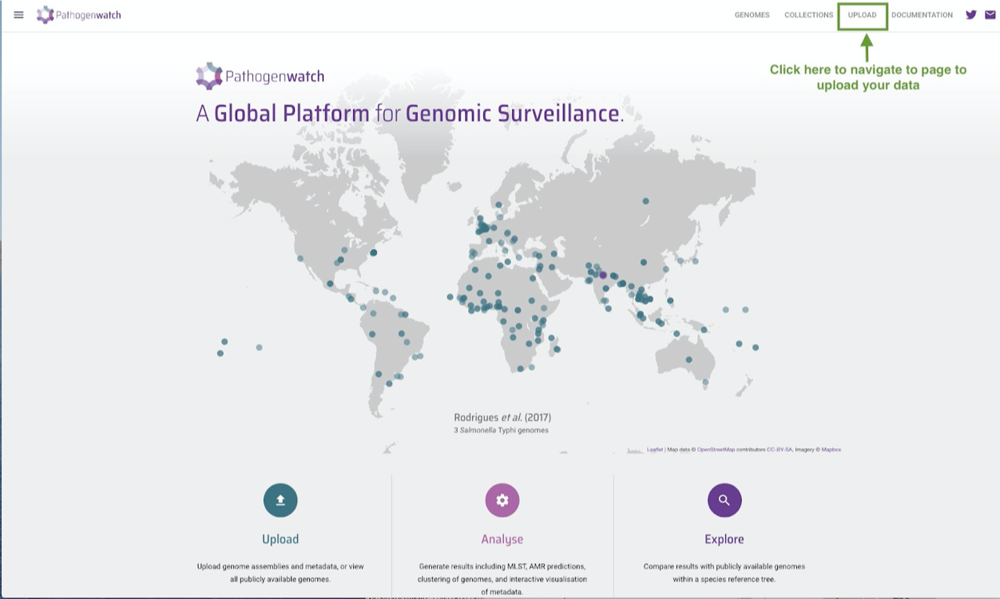
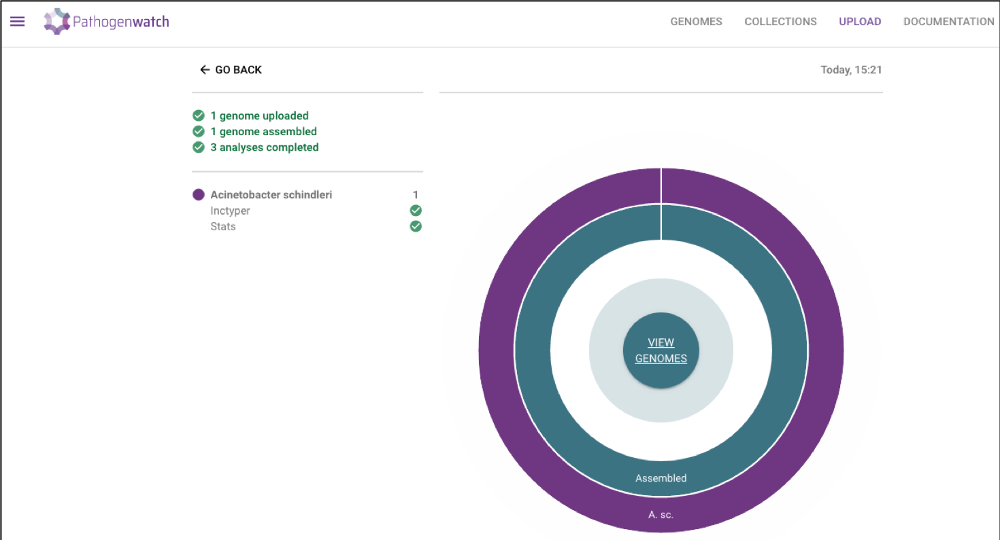
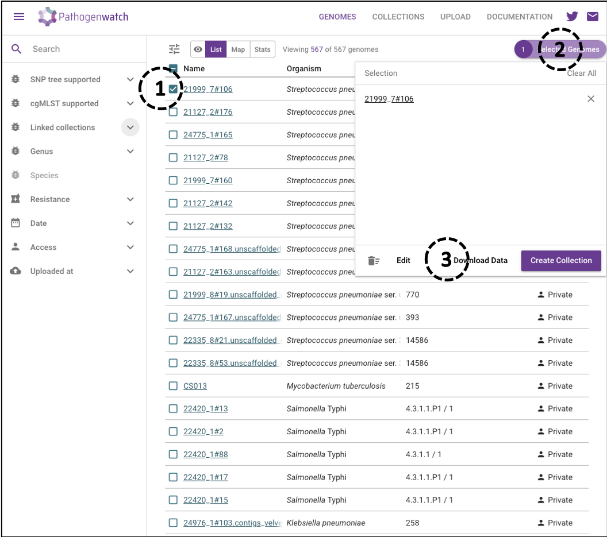
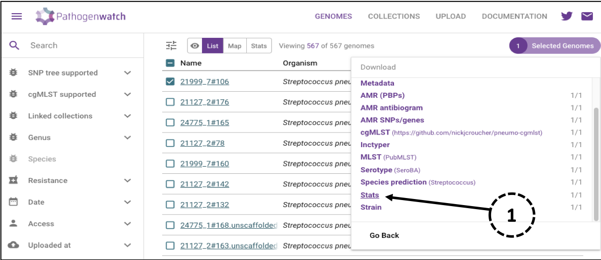
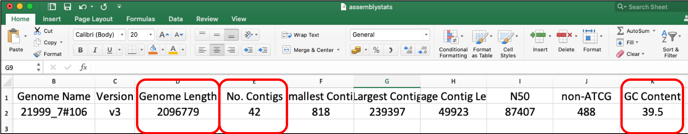

<h1 style="text-align:center">Assembly</h1>

In the previous section, we learnt how to assess the quality of raw reads. In this section we will use the reads to perform the process of assembly.

Genome assembly refers to the process of putting nucleotides in the correct order. Assembly is required as the sequence reads generated by the sequencers are a lot smaller than a genome or even gene. For example, the read length generated by illumina sequencers ranges from 100 to 300 bases while the average genome size of _S. pneumoniae_ is ~2 Mb. Traditionally, the assembly process involved joining the reads together based on the overlapping sequence into [contigs](https://en.wikipedia.org/wiki/Contig) (long continuous sequence). With the evolution of rapid sequencers, the reads have become shorter and high throughput has increased making it challenging to perform assembly. A number of bioinformatic tools such as SPAdes and Velvet have been developed, which use one of three approaches to perform assembly: greedy, overlap-layout-consensus or de Bruijn graph. The details of these algorithms are beyond the scope of this module but if you are interested in finding out more, then please refer to[ Advances in Genetics](https://www.sciencedirect.com/topics/agricultural-and-biological-sciences/genome-assembly), chapter 7.2 on sequence assembly. The majority of these tools are command-line based and require some command-line skills to be able to use them. However, there are some web-based tools that can take in sequence reads and perform assembly. Here we will be using Pathogenwatch, which was introduced in the [F1 module](https://training.bactgen.sanger.ac.uk/#/F1/), to perform assembly and assess assembly quality.

# Example: Assembly of the sequence reads

In this section we will perform assembly of _S. pneumoniae_ isolate (21999_7#106).

Firstly, navigate to the [Pathogenwatch website](https://pathogen.watch/). Then click on the 'upload' button on the Pathogenwatch home dashboard (Figure 6). You will then be required to sign in.

**Figure 6: Landing page of Pathogenwatch website**

You can then upload your fastq data. We recommend that you watch the Pathogenwatch video ([sequence assembly](https://training.bactgen.sanger.ac.uk/#/F1/pathogenwatch), time stamp 0:54 onwards) to learn how to upload your reads and assemble the contigs.

Once the process is complete you can select “view genomes” (Figure 7) to see a tabulated summary of the uploaded genomes as shown in Figure 8.

**Figure 7: Completed analysis of the sequence data**

Now select the isolate you just uploaded (21999_7#106) (circle1, Figure 8) and click on the “selected genomes” tab on the top-right corner (circle2, Figure 8). In order to access the assembly statistics data click on the option “Download file”(circle3, Figure 8).

**Figure 8. Accessing the analysis results**

This will open another small window (Figure 9) with many features about the isolate that Pathogenwatch has identified from the sequence reads. In order to access the assembly statistics select the “stats” option (circle1, Figure 9) and save the resulting .csv file on your computer.

**Figure 9: Downloading the assembly statistics**

Open the .csv file you just downloaded, and you will see the assembly statistics as shown in Figure 10. Important metrics which can reflect on the quality of the assembly are highlighted by red boxes in the Figure 10.

**Figure 10: Assembly statistics of the sequence data**

A good assembly is categorised as those having a number of contigs &lt;500, total length of the assembled sequences is within a certain range and GC% that matched the species of our interest. For _S. pneumoniae_ the assembled length (genome length) should be between 1.9 -2.3 MB. Since the example used here is of _S. pneumoniae_ and the number of contigs is &lt;500, the total length is between 1.9 - 2.3 MB and the GC% is between 38.5 - 40.0, the contigs assembled are good and can be used for further downstream analysis. Higher number of contigs (>500) could also indicate possible contamination of the sequence reads. Additionally, having assembled genome size lower than the threshold could indicate lower overall sequencing coverage or throughput while higher genome size could indicate contamination.  

>Exercise 2
 **Now perform the assembly of the sequence reads for the isolates (21999_7#180, 28184_2#97 and 33816_1#103 ) provided to you and answer the following questions:**
 1. Do all the three isolated belong to _S. pneumoniae_ ?
 2. Does the sequence assembly is of good quality for all the three?

 &copy; [Wellcome Sanger Institute](https://www.sanger.ac.uk/)
