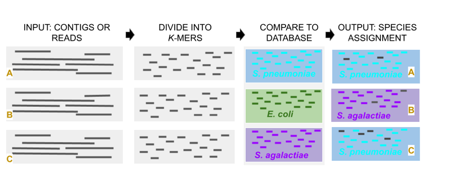
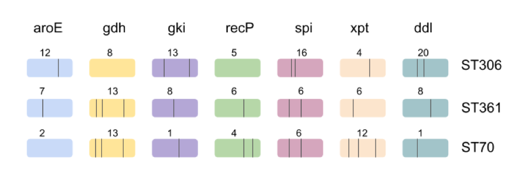
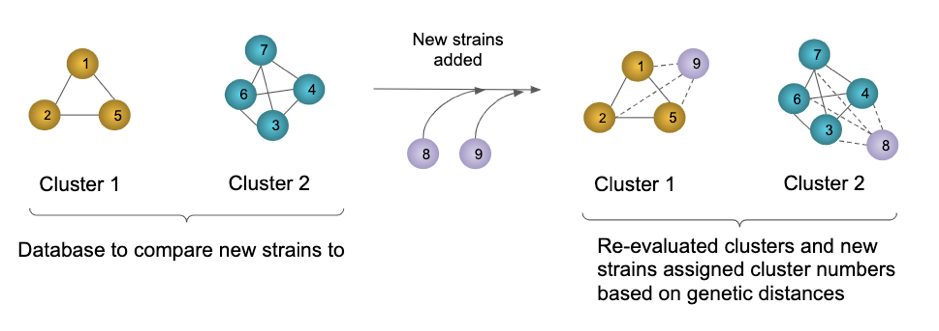
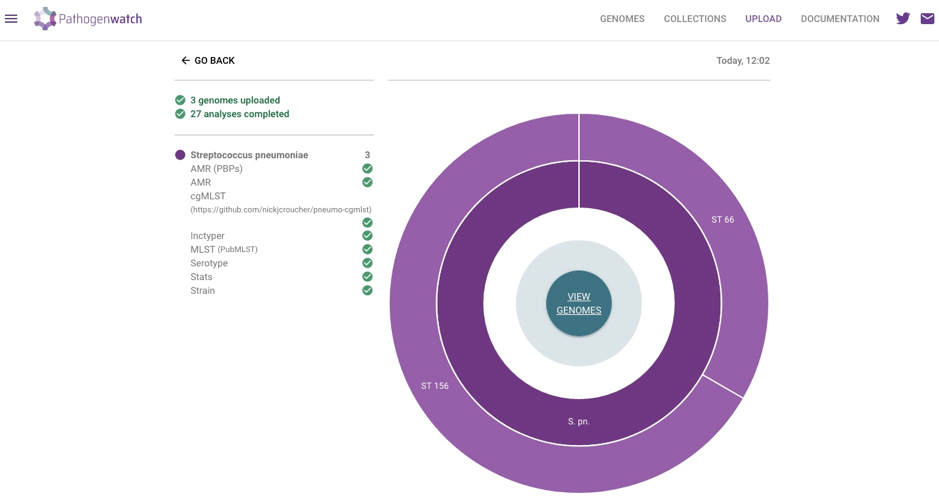
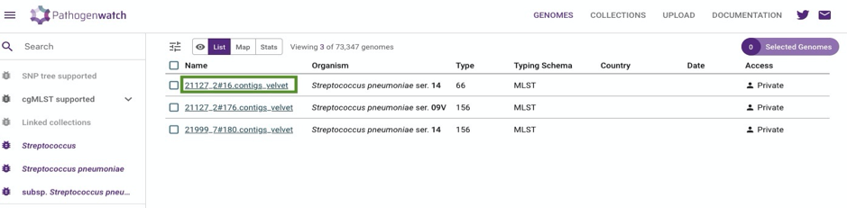
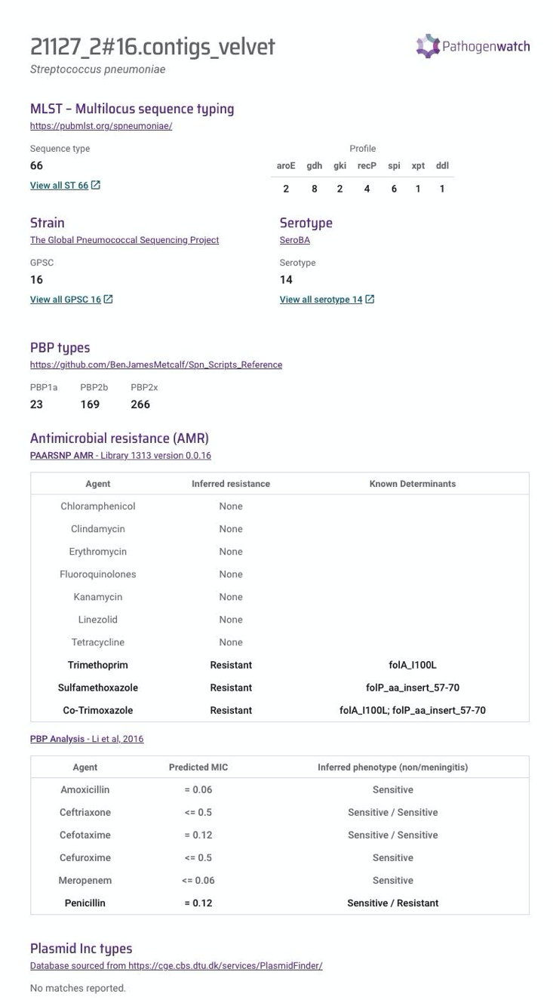
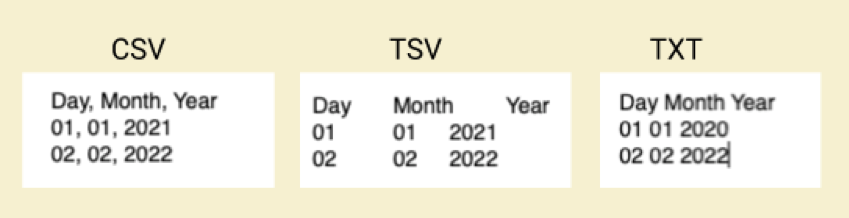
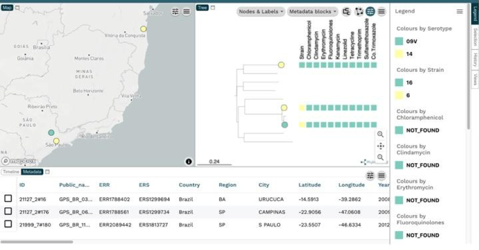

<h1 style="text-align:center">Genotyping</h1>

Genotyping is characterisation of bacteria based on genetic content, this enables differentiation of bacteria beyond the species/subspecies level. In this module we are focusing on sequenced-based genotyping. The characteristics of typing methods vary in their discriminatory power, and the method needs to be appropriate to address the question e.g. outbreak detection or long-term surveillance. Genotyping using whole-genome sequence data can be conducted in many different ways. In this module we will focus on easy to use, web-based tools. We will build upon your knowledge and introduce command line based tools in the next module.

---
# Species identification

Determining the species is a crucial first step in your analysis. Species identification using the 16S rRNA gene sequence has been a common method, as 16S rRNA genes are ubiquitous in bacteria and are highly conserved. However, the 16S rRNA represents a very small fraction of the genome and comparing the whole genome sequence data to a reference database of known bacterial species can be more informative than 16S typing. To reduce the computational effort, the reads or contigs can be divided into small pieces, termed _k_-mers. A _k_-mer is a contiguous sequence of _k_ bases, where _k_ can be any positive integer so _7_-mer is a sequence that is 7 bases long. Tools can break the sequence of your isolate of unknown bacterial species into k-mers and compare these k-mers with a curated database of _k_-mers from known bacterial species. Genome sequences that share a high percentage similarity share a high percentage of _k_-mers. In the practical section of this module we will be using the species assignment tool within Pathogenwatch called [Speciator](https://cgps.gitbook.io/pathogenwatch/technical-descriptions/species-assignment/speciator).

**Figure 11. Illustration of species identification of an unknown genome, using a k-mer based approach to query a database of k-mers from known bacterial species.**

---
# Multi-locus sequence typing (MLST)

MLST is a commonly used sequence-based method to type bacterial species. There are publicly available MLST schemes for over 100 bacterial species including _S. pneumoniae_ and _S. agalactiae_. The schemes are typically based upon the sequences of internal fragments of seven house-keeping genes which are present in almost all strains of the species. There is a database of variants of these genes, termed alleles, which are each given a number.  The combination of alleles of your isolate determines the overall sequence type “ST” code (Figure 12).

**Figure 12. Illustration of MLST typing. Each gene is indicated with a number denoting its allelic variant. The combination of numbers (profile) determines the sequence type.**

There are multiple web-based platforms that enable you to upload your sequence data and return MLST results. In Pathogenwatch, the genome assembly is searched for exact matches to known alleles in the [PubMLST](https://pubmlst.org/) database and sets of alleles for each locus are then searched for using ​​Basic Local Alignment Search Tool (BLAST). The similarity and length of the match is used to determine the allele call and the combination of alleles determines the MLST. Novel alleles and profiles are given unique identifiers.

---
# Serotyping

There are over 100 known _S. pneumoniae_ serotypes and the gold standard for serotyping is the Quellung reaction. Serotype can also be confidently predicted directly from short read data using _in silico_ tools including SeroBA, which is a _k_-mer based method that accurately detects the _cps_ locus even at low coverage and is scalable to large datasets [(Epping et al., 2018)](https://www.microbiologyresearch.org/content/journal/mgen/10.1099/mgen.0.000186). It is important to note that the results from _in silico_ prediction sometimes do not match the phenotypic result, and should not be used for clinical purposes. Pathogenwatch integrates the SeroBA tool into an easy to use platform which we will introduce in the practical section of the module.

---
# Antimicrobial resistance (AMR) prediction

Genotypic resistance can be predicted _in silico_ from whole genome sequencing (WGS) data. Successful _in silico_ prediction of AMR phenotype from WGS data is dependent upon sequence quality and having a comprehensive database of antimicrobial resistance genes (ARGs) and mutations conferring AMR.

There are publicly available databases of AMR genes and point mutations, with varying levels of comprehensiveness, curation and regularity of updates. The method and database used influence the sensitivity and specificity of detection of ARGs and point mutations, and should be considered when comparing studies and outputs of surveillance programmes ([Doyle et al., 2020](https://pubmed.ncbi.nlm.nih.gov/32048983/)). Multiple studies have shown high concordance between AMR phenotype and genotype, including for _S. pneumoniae_, though specificity and sensitivity varies between antimicrobials ([Metcalf et al., 2016](https://www.sciencedirect.com/science/article/pii/S1198743X16303020); [Neuert et al., 2018](https://www.ncbi.nlm.nih.gov/pmc/articles/PMC5880904/); [Zankari et al., 2012](https://academic.oup.com/jac/article/68/4/771/705760?login=false)).

It is important to remember that current _in silico _AMR prediction is not suitable for clinical purposes; they do not detect novel AMR mechanisms or variants with low homology to other genes in the database used, and require investigation with approaches such as genome wide association studies . Additionally, an ARG may be present but not expressed, resulting in non-concordance between genotype and phenotype ([Feldgarden et al., 2019](https://pubmed.ncbi.nlm.nih.gov/31427293/)).

There are multiple available web-based and command-line tools for detecting antimicrobial resistance genes. The _S. pneumoniae _AMR gene library used by Pathogenwatch was provided by the GPS team and was last updated in April 2020. The tool works by using a Blast query of your assembly against the BLAST library of reference genes. A hit is called if the library sequence coverage (90%) and percentage identity (80%) threshold for a gene is met. For _S. pneumoniae_ Pathogenwatch predicts beta-lactam resistance, including penicillin resistance, using a machine learning model developed by the Centre for Disease Control and Prevention ([Li et al., 2016](https://pubmed.ncbi.nlm.nih.gov/27302760/); [Metcalf et al., 2016](https://www.sciencedirect.com/science/article/pii/S1198743X16303020)). This model generates minimum inhibitory concentration (MIC) predictions, and classification of isolates as susceptible, intermediate or resistant based on Clinical and Laboratory Standards Institute (CLSI) guidelines, including separate MIC thresholds for meningitis infections.

---
# Lineage assignment

Nucleotide variation across the whole-genome can be used to cluster isolates into lineages. Determining the pneumococcal lineage to which your isolates belong can lead to insights including ascertaining geographic spread and associations of lineage with key characteristics including antimicrobial resistance.

A tool called [PopPUNK](https://poppunk.net/) has been created to efficiently assign isolates to clusters. PopPUNK stands for Population Partitioning Using Nucleotide k-mers. This tool does not require alignments or annotations, or even assemblies. PopPUNK breaks the sequence data into _k_-mers, and compares _k_-mers between the samples to cluster isolates using machine learning methods. Clusters are defined by a network which is drawn by how similar the core and accessory distances isolates are to one another; the connected components in the network become the PopPUNK clusters (Figure 13). This network can be used to generate a database which enables you to assign additional genomes to clusters, without having to re-run clustering on a large number of genomes. The names of clusters do not change as new isolates are added in this way, meaning studies can easily be compared.  

**Figure 13. Illustration of the concept of assignment of new strains to clusters using PopPUNK**

Global Pneumococcal Sequence Clusters (GPSCs) have already been defined based on >20,000 pneumococcal isolates from the GPS collection using PopPUNK. The model fit of this database has been verified, and ready for you to use. PopPUNK is integrated into the Pathogenwatch platform, which you will use later to characterise 10 Brazilian _S. pneumoniae_ genomes.

On the GPS website you can [view individual GPSCs](https://www.pneumogen.net/gps/GPSC_lineages.html), with links to Microreact instances of global isolates for each GPSC.

---
# Genotyping exercise

In Fundamental 1, we used Pathogenwatch to select, view and download published data and in the assembly section of this module you used Pathogenwatch to assemble genomes and evaluate assembly statistics. In this exercise, we will show you how to use Pathogenwatch to genotype your isolates, and to interpret the results. We will then visualise the genotype information using Microreact.

We are going to use data for 10 _S. pneumoniae_ isolates from Brazil. These isolates were selected to represent some of the most common lineages and serotypes observed in the overall dataset of whole-genome sequences of 446 isolates from both pre-PCV10 and post-PCV10 periods in Brazil. You can read more about GPS partner Samanta Almeida’s experience of learning to analyse the data [here](https://www.pneumogen.net/gps/capacity_building.html), and the publication is free to access [here](https://www.microbiologyresearch.org/content/journal/mgen/10.1099/mgen.0.000635?crawler=true).

**_Note: Currently, Pathogenwatch is able to identify Group B streptococcus and determine MLST. The Juno team is working with the Pathogenwatch team to support additional genotyping including serotyping and detection of antimicrobial resistance genes and mutations. We will let you know when this is ready for you to use!_**

1. Navigate to the [Pathogenwatch site](https://pathogen.watch/) as you did for the assembly exercise
2. Upload your data. Pathogenwatch accepts multiple data upload options. We have provided you with single genome FASTAs for genotyping, so select the ‘Single Genome FASTAs’ option
3. Now you need to drag and drop the ten FASTA files on the webpage. Your genome data will automatically upload and be processed, as occurred when you uploaded FastQ files but this time no assembly is required. When the processing is complete you will see completed concentric circles, similar to Figure 14. You can now click on ‘VIEW GENOMES’ in the centre of the circle to view your results.

**Figure 14. Completion of genotyping processing by Pathogenwatch**

## 1. Reviewing your results

a. **Isolate reports.** You can now see a row for each genome. You can click on the name of an individual isolate (example shown in Figure 15) to view the overall report (Figure 16).

b. **Using filters.** If you upload many genomes you may want to filter the genomes based on characteristics such as AMR or MLST.

**Figure 15. Click on the name of an individual isolate (e.g. 21127_2#16, highlighted by the green box) to view the full report.**

**Figure 16. Example of an isolate report from Pathogenwatch**

## 2. Download your data

You will download the genotype data in the same way as you downloaded assembly statistic information. If you check the boxes on the left side you can select the genomes, and then download the data by clicking on “Selected Genomes” on the right-hand side of the screen, followed by “Download data” and then the individual file that you want to download. Unfortunately there is no easy way of downloading all of the data at once. You will need to download the csv files of interest individually. Each file will have a single row of information per isolate “Genome.Name”.

a. **AMR**
 &nbsp;&nbsp;&nbsp;&nbsp;&nbsp;&nbsp;i. AMR antibiogram
 &nbsp;&nbsp;&nbsp;&nbsp;&nbsp;&nbsp;&nbsp;&nbsp;&nbsp;&nbsp;Provides a summary of predicted antimicrobial sensitivity phenotypes
 &nbsp;&nbsp;&nbsp;&nbsp;&nbsp;&nbsp;ii. AMR SNPs/genes
 &nbsp;&nbsp;&nbsp;&nbsp;&nbsp;&nbsp;&nbsp;&nbsp;&nbsp;&nbsp;There is more detailed AMR information in this file, which details SNP variants associated with resistance, and acquired antimicrobial resistance genes for each isolate.
 &nbsp;&nbsp;&nbsp;&nbsp;&nbsp;&nbsp;iii. AMR (PBPs)
 &nbsp;&nbsp;&nbsp;&nbsp;&nbsp;&nbsp;&nbsp;&nbsp;&nbsp;&nbsp;This file provides more detailed information about predicted resistance to beta-lactam antimicrobials.

b. **MLST (PubMLST)**
 The “ST” column tells you the sequence type for the isolate, and the following 7 columns provide you with the allele variant information that contribute to the ST designation.

c. **Serotype (SeroBA)**

d. **Strain (PopPUNK)**
 This is the Global Pneumococcal Sequence Cluster (GPSC) to which the isolate has been assigned.  

## 3. Merge the genotype data csv files and metadata csv file

Metadata is a crucial data in interpretation of sequence data. It is imperative that before you embark on a sequencing project, you have a hypothesis and that you collect the relevant metadata that will accompany WGS data.

With most analysis programs that ask you to input metadata, they would ask it in the form of a CSV, TSV or TXT file. These are simple text files (commonly termed flat files) that contain tabular information (Figure 17). The file types are named by the type of delimiter or separator they use. CSV uses a comma, hence its called a Comma Separated Value file, a TST is a Tab Separated Value file, and values in a TXT or text file are separated by spaces. You can use software such as Excel to export this type of table and the suffix will be denoted as file.csv, file.tsv or file.txt. Note: for Excel tab delimited files are as saved as .txt and space delimiters are saved as .prn).

**Figure 17. Examples of common metadata file types**

We have provided you with a csv file containing metadata for the genomes, including collection date and location. You will now need to join this metadata file with each genotype data file so that we can visualise the data in Microreact.

You should merge the metadata provided and the genotype data in a way that you are familiar with e.g. using R statistical software. If you are unfamiliar with such software, we suggest opening the files in Excel and copying the data into a single file. If using this approach then make sure that the ID order is consistent in the metadata and genotype data.  

From each genotype information file, select only the columns of interest; it is not necessary to retain version information, or the genome ID provided by Pathogenwatch, as the “Genome Name” is the ID that will match the tree tips in our phylogeny.

## 4. Data visualisation

You were introduced to [Microreact](https://microreact.org/) in F1, in which you explored the functionality of the visualisation software using pre-prepared files. Here, we will now use Microreact to visualise the genotyping data that you have generated, alongside a phylogeny that we have provided. The practical generation of phylogenies will be covered in future course material, in which we introduce working with the command line.

A new version of Microreact has been released since you completed the F1 training. The functionality remains highly similar to the previous version, but take the time to re-familiarise yourself with the new version. The Microreact team provide some great tutorials, including two [introductory videos](https://docs.microreact.org/introductory-video) which show you how you can explore your data such as changing the data shown on the tips of the phylogeny, selecting nodes of interest and visualising multiple columns of your data using the “metadata blocks” function.

a. **Follow this simple** [guide](https://docs.microreact.org/instructions/creating-a-microreact-project) to set up and save your new project

b. **Explore your data**
 &nbsp;&nbsp;&nbsp;&nbsp;&nbsp;&nbsp;i. Do multiple isolates share a serotype and/or lineage? If so, do they
 &nbsp;&nbsp;&nbsp;&nbsp;&nbsp;&nbsp;&nbsp;&nbsp;&nbsp;&nbsp;1. Cluster together in the phylogenetic tree?
 &nbsp;&nbsp;&nbsp;&nbsp;&nbsp;&nbsp;&nbsp;&nbsp;&nbsp;&nbsp;2. Cluster together geographically or temporally?
 &nbsp;&nbsp;&nbsp;&nbsp;&nbsp;&nbsp;ii. Create a visual summary of AMR summary data and strain (lineage) using the “metadata blocks” functionality, with the  tips of the phylogeny coloured by serotype (an example, using data for three isolates is shown below).
 &nbsp;&nbsp;&nbsp;&nbsp;&nbsp;&nbsp;&nbsp;&nbsp;&nbsp;&nbsp;1. Are there common patterns of AMR?
 &nbsp;&nbsp;&nbsp;&nbsp;&nbsp;&nbsp;&nbsp;&nbsp;&nbsp;&nbsp;2. Do isolates of the same serotype and/or strain have the same AMR profile?

 &copy; [Wellcome Sanger Institute](https://www.sanger.ac.uk/)
