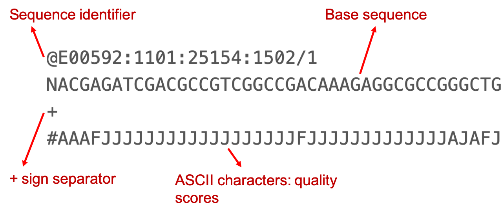
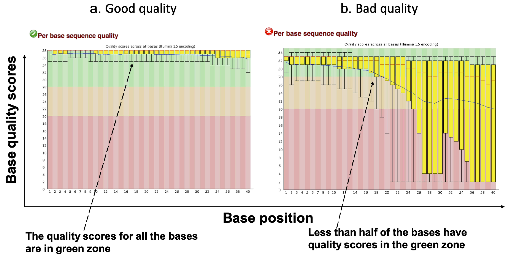
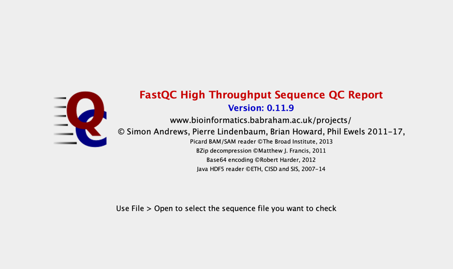
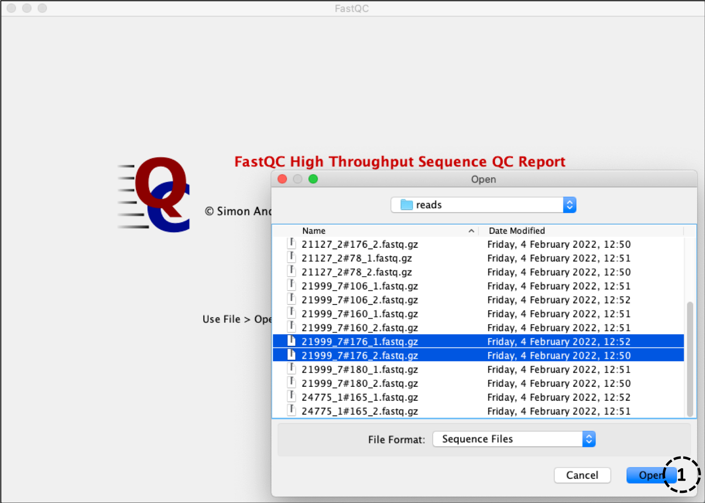
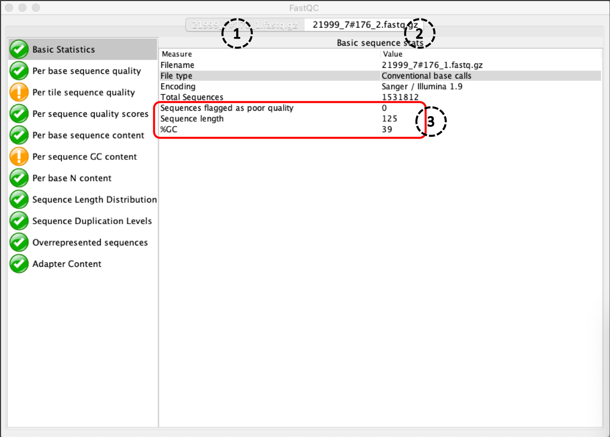
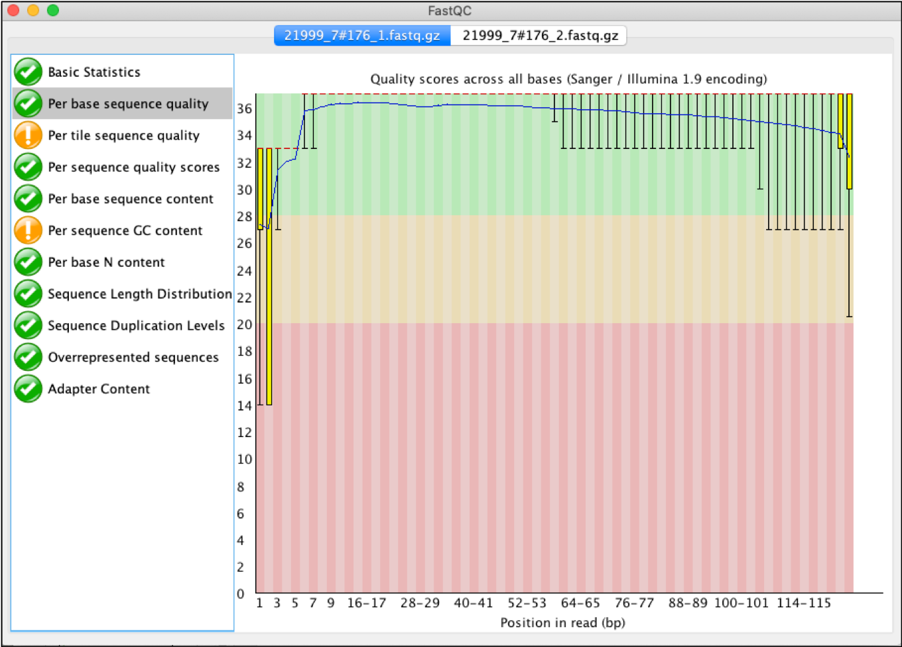

<h1 style="text-align:center">Sequence quality</h1>

# Sequence data formats

Next-Generation sequencing has advantages over traditional methods and is becoming a popular tool for public health surveillance. Currently there are multiple sequencing platforms, including Illumina, PacBio and MinION which have varying throughput capabilities and costs per sample. As sequencing is becoming a routine practice for pathogen surveillance and for guiding public health interventions, the demand for sequence data analysis is rising. For robust data analysis it is essential to have some basic understanding of the sequence data formats. The majority of sequencers used globally generate reads in FastQ format, which includes both the bases read during the sequencing and corresponding quality scores.

## FastQ format

**Figure 1: Sequence read in FastQ format**

As shown in Figure1, each sequence read is represented by 4 lines;

* **1st line** is the sequence identifier which contains information about the sequencing process and is unique for each read
* **2nd line** is the sequence of bases read during sequencing process,
* **3rd line** start with “+” sign and is the separator and sometimes can contain the same information as identifier minus the “@” symbol
* **4th line** contains the [quality scores](https://emea.illumina.com/science/technology/next-generation-sequencing/plan-experiments/quality-scores.html). The quality scores represent the probability of a base being read incorrectly by the sequencer. The higher the quality score the less is the probability of it being incorrect. The quality scores are represented by[ ASCII characters](https://en.wikipedia.org/wiki/FASTQ_format#Encoding) and can be used to infer the quality of bases. You can read more about the FastQ format[ here](https://help.basespace.illumina.com/articles/descriptive/fastq-files/). The widely accepted threshold for quality score/value is 20, below which the base is considered to be low quality and is usually excluded or removed from the sequence data before proceeding for downstream analysis. A quality score of 20 would mean the probability of incorrect base is 1 in 100.

**Note:** The FastQ files generated by the sequencers are usually zipped, due to its large size. It is unwise to unzip these files. Downstream bioinformatics analysis tools are almost always able to work with the zipped file. Depending on which sequence program you select, ‘single end’ or ‘paired-end’ will determine how many files you have. For Illumina reads, there will be a single 'fastq.gz' file for the single end sequencing and two files for the paired-end sequencing, denoting the read1 (_R1.fastq.gz) and the read2 (_R2.fastq.gz).

---

# Assessing sequence data quality

A typical whole genome sequencing process involves sample preparation, library preparation and sequencing. Errors occurring at each of these steps can negatively impact the quality of the sequence information. For example, the samples could be mixed during sample or library preparation, or errors can be encountered during the sequencing itself. If these errors are not removed from the raw reads, they might be incorporated into your analysis output and would be harder to resolve later on. Therefore, it is important to perform quality checks on the raw sequence reads before starting your analysis.

There are several bioinformatic tools available for evaluating read data quality, here we will discuss one of the widely used tools, called[ FastQC](https://www.bioinformatics.babraham.ac.uk/projects/fastqc/) which is made available from Babraham Institute. The tool also has a graphical user interface so can be used without using the command-line. The tool provides you with a report on the quality of sequence reads using a traffic light system, red, amber and green. Below are the two screenshots of how a good sequence data (a) and bad sequence data (b) is shown in the tool. In addition there are a number of other parameters which we will learn in the following sections that can be inferred from the FastQC tool.

## Example: Assessing quality of sequence reads

In this example we will assess the quality of sequence reads generated for one of the _Streptococcus pneumoniae_ isolates (21999_7#176) using the FastQC tool.

Getting FastQC installed on your computer:

[Download](http://www.bioinformatics.babraham.ac.uk/projects/download.html#fastqc) the FastQC software, making sure to have read the [installation instructions](https://raw.githubusercontent.com/s-andrews/FastQC/master/INSTALL.txt). For Windows users, you will need to have Java RE installed or you can download it from [here](https://www.oracle.com/java/technologies/javase-jre8-downloads.html). You will need the ‘Windows x64’ .exe version. For mac users, download the ‘dmg’ file, double click and drag the file into your applications folder. If you are having trouble opening the software please consult the [installation and set-up instructions](https://raw.githubusercontent.com/s-andrews/FastQC/master/INSTALL.txt) outlined. Once you have installed FastQC properly a window like the one below (Figure 2) should appear when you click on the FastQC icon.

**Figure 2: Landing page for FastQC tool**

We have provided forward and reverse read files with suffixes **_1.fastq.gz** and **_2.fastq.gz** respectively, obtained from paired-end Illumina sequencing. Please download the FastQ files from here.

**Note:** When you work with your own sequencing data, other naming conventions may be used. Also, if you are on a secure network, you may not be able to access the  FastQC website. You should try and download the files outside the network or contact your IT department for help.

Once you have opened the FastQC click on the file option on the top left corner of the window. Now, navigate to the folder where you just downloaded the read files (Figure 3), select them and click open (circle1).

**Figure 3: Uploading sequence files for analysis in FastQC**

The program should now automatically start analysing the read data and should only take a few minutes. Upon completion, the first page will show the ‘basic sequence stats’, which gives you an overall summary of the sequence reads. You should pay attention to the %GC content, sequence length and the amount of sequences flagged as poor quality. For example, Figure 4 shows the sequence data summary of one of the isolate (21999_7#176). Since this is the paired end sequencing two separate files were uploaded  as shown by circle1 and circle2 shown by the two tabs on the top (figure 4). The red box (circle3) highlights the key information about the sequence reads and the %GC which is 39 as should be for _S. pneumoniae_. There are 0 reads assigned as bad quality indicating good quality sequence data.

**Figure 4: Report generated by FastQC**

Navigate to the ‘per base sequence quality’ page. You should see a graph like Figure 5. The graph represents the average quality of bases over the entire read length. The space coloured in the green regions shows high quality, the amber coloured region below reflects acceptable quality and the regions in the red shows low quality. Therefore, if you observe the line in the red region for your sequence reads, it means the probability of a base call being incorrect is higher.

**Figure 5: Read quality distribution over the read length**

Now, check the sequence read 2 and compare with the first. Is it better or worse?

**Note:** _Sometimes the read quality towards the end of reads tends to fall in the red region, indicating bad quality of bases. In this case we use other programs like [trimmomatic](http://www.usadellab.org/cms/?page=trimmomatic) or [fastp](https://github.com/OpenGene/fastp) to trim the ends of the reads with bad quality bases before proceeding for further analysis._

Familiarise yourself with the other reports and what they mean. FastQC have prepared [detailed documentation](https://www.bioinformatics.babraham.ac.uk/projects/fastqc/Help/3%20Analysis%20Modules/) for understanding the results shown in the report.

>Exercise 1
 **Perform the same series of steps as described in example 1 on sequence reads (21999_7#180 and 21127_2#16) and answer the following questions:**
 1. What is the read length/sequence length in the case of 21999_7#180?
 2. What can you say about the quality of the sequence reads for the isolate 21127_2#16, is it good or bad and why?

 &copy; [Wellcome Sanger Institute](https://www.sanger.ac.uk/)
